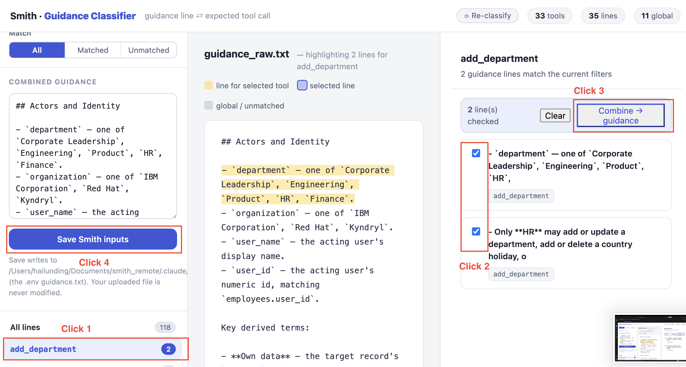

# Enterprise Employee Hub — Smith Example (Experimental example)

An SQLite-backed employee hub exposed through a FastMCP tool server and a
LangGraph ReAct agent. The hub covers employee records, the org chart,
departments, sensitive personal records (passport, visa, emergency contact,
bank account), country holidays, and time-off (allotments, requests, and
balances).

This experimental example uses a large guidance file with conflicting and
out-of-scope rules. Some rules need information unavailable to a stateless OPA
policy. It exercises Smith's workflow on a realistic set of tools with those limits.

## MCP Tools

The server exposes 33 tools across six areas. `smith/tool_definitions.json`
records the tools selected for the current Smith session.

| Area | Tools |
|------|-------|
| Employees | `add_employee`, `update_employee`, `get_employee`, `list_employees` |
| Org chart | `get_manager`, `get_direct_reports`, `get_reporting_chain` |
| Departments | `add_department`, `update_department`, `get_department`, `list_departments` |
| Personal records (sensitive PII) | `set_passport`, `update_passport`, `get_passport`, `set_visa`, `update_visa`, `get_visa`, `set_emergency_contact`, `update_emergency_contact`, `get_emergency_contact`, `set_bank_account`, `update_bank_account`, `get_bank_account` |
| Leave and time-off | `set_leave_allotment`, `get_leave_allotments`, `create_time_off_request`, `update_time_off_status`, `get_time_off_request`, `list_time_off_requests`, `get_leave_balance` |
| Holidays | `add_holiday`, `list_holidays`, `delete_holiday` |

## Starting the Agent

Prerequisites (run from the Smith skill directory):

```bash
bash scripts/clean.sh # optional: remove generated results and clear assets/policy.rego
cd examples/employee
uv sync
uv run python init_db.py     # create employee_hub.db
```

Make sure the `.env` in the Smith skill directory points to this example:

```dotenv
TARGET_AGENT_PATH=examples/employee/
GUIDANCE_FILE=examples/employee/smith/guidance.txt
SYSTEM_VAR_FILE=examples/employee/smith/system_vars.json
PROMPTFOO_CONFIG_FILE=examples/employee/smith/promptfooconfig.yaml
PROMPTFOO_OUTPUT_FILE=examples/employee/smith/redteam.yaml

INFERENCE_MODEL=aws/claude-haiku-4-5
INFERENCE_BASE_URL=${OPENAI_BASE_URL}
INFERENCE_API_KEY=${OPENAI_API_KEY}

MCP_TRANSPORT=stdio
MCP_COMMAND=python
MCP_ARGS=server.py
MCP_CWD=examples/employee/
```

Start the agent:

```bash
uvicorn agent:app --host 0.0.0.0 --port 9000
```

The agent exposes:

- `POST /chat` — full agentic chat (executes tools via MCP)
- `POST /extract_tool_call` — extracts intended tool call without executing it

The agent launches the MCP server automatically over stdio; you do not need to start it separately. A simple REPL is also available with `uv run python agent.py`.


## Smith Files (`smith/` directory)

| File | Description |
|------|-------------|
| `guidance_raw.txt` | Full source guidance to upload to the Guidance Classifier. |
| `guidance.txt` | Selected guidance saved by the browser; the source for policy generation. |
| `system_vars.json` | System variables available in the agent session (`department`, `organization`, `user_name`, `user_id`) plus the action list/descriptions. Maps to `input.extensions.subject.*` in the OPA policy. |
| `tool_definitions.json` | Definitions and parameters for the tools selected in the current session, generated by `smith --flag get_mcp_parameter`. Maps to `input.arguments.*`. |
| `promptfooconfig.yaml` | Promptfoo configuration for red-team test generation against this agent. Can be auto-generated with `smith --flag generate_promptfoo_config` (LLM + deterministic — review output before use). |
| `extension_suggestions.json` | Rules outside the current tool selection and suggestions for including those tools in a future run. |
| `smith_outputs/` | Intermediate results generated when running Smith (see below). |

### `smith/smith_outputs/` (for reproducibility: generated artifacts)

| File | Description |
|------|-------------|
| `tool_definitions.json` | Saved snapshot of the selected tool definitions. |
| `specs/` | Decomposed specifications for individual tools and shared rules. |
| `add_department/` | Saved generated and revised policies, bypass report, and test cases for the `add_department` run. |
| `add_department_employee/` | Saved generated policy, bypass report, and test cases for the combined tool selection. |

## How to Test Smith (End-to-End Workflow)

### Step 0: Select Tools and Guidance

From the Smith skill directory, start the Guidance Classifier:

```bash
smith --flag classify_guidance
```

Open the URL printed by the command (`http://127.0.0.1:8110/`) in a browser
or VS Code's Simple Browser. Then:

1. Upload `examples/employee/smith/guidance_raw.txt`.
2. Step1: Select a tool, such as `add_department`.
3. Step2: Check the guidance lines you want to enforce.
4. Step3: Click **Combine → guidance** and review the combined text.
5. Step4: Click **Save Smith inputs**.

Saving overwrites `examples/employee/smith/guidance.txt` and records the selected
tools in `references/session_config.json`. The uploaded source file is unchanged.



### Step 1: Generate Policy and Test Cases

#### Step 1.1: Generate Policy

Ask your coding assistant to use the Smith skill to generate an OPA policy from the guidance file:

> Prompt: /smith generate an opa policy for the target agent

If Smith asks whether to limit the scope to the selected tools, confirm.

#### Step 1.2: Generate Test Cases

There are three ways to generate or reuse test cases:

1. After generating the policy, Smith asks whether to generate test cases or reuse existing ones. If generating cases, follow its suggestions to refresh the Promptfoo config, generate cases, and translate them. Test case evaluation is optional.

2. Generate test cases via CLI:

   ```bash
   smith --flag generate_promptfoo_config # optional: generate and review the Promptfoo config
   smith --flag test_generation --mode fresh # required: generate guidance-targeted cases
   smith --flag bypass_case_generation    # optional: policy-bypass cases (requires an existing, non-empty policy)
   smith --flag test_case_evaluation      # optional: visualize test cases without changing results
   smith --flag test_case_translation     # required: translate cases, skipping those already translated
   ```

3. To reuse the saved `add_department` cases, copy
   `examples/employee/smith/smith_outputs/add_department/test_cases/` to
   `references/test_cases/`, then skip generation and translation.

### Step 2: Test the Policy

Run policy testing (via CLI or ask Smith):

- Smith: Follow Smith's suggestions and approve policy testing.

- CLI:

    ```bash
    smith --flag policy_testing
    ```

### Step 2.1: Cross-Validation

- **If there are 0 test cases or a 100% failure rate** — the policy may have structural or syntax issues. Ask Smith to cross-validate the policy (it will follow `opa_policy/policy_cross_validation/policy_cross_validation.md`).
- **If some tests pass and others fail** — some test case labels may be wrong. Ask Smith to cross-validate the test cases before running the refinement loop (it should follow `test_generation/cross_validate.md`). This step can take time, depending on the number of failed test cases.

### Step 3: Improve the Policy

### Step 3.1: Patch the Policy

If no test cases fail, Smith skips this step.

If test cases fail, follow Smith's suggestions to patch the policy:

**Fix failed test cases** — patch the policy to handle cases that should be denied but are currently allowed.

### Step 3.2: Lint the Policy

**Fix formatting issues** — resolve Regal lint warnings and `opa fmt` differences.

### Step 3.3: Remove Duplicate Rules

**Remove duplication** — eliminate redundant rules with overlapping logic.

## Expand the Tool Scope

To add `add_employee` to the existing `add_department` selection, return to
Step 0 and check the lines for both tools. Click **Combine → guidance**, review the
result, and click **Save Smith inputs**. Saving replaces the current
`guidance.txt` with the combined guidance.

Repeat Steps 1–3. But at this turn, you can choose update test cases rather than generate from scratch. 

```bash
smith --flag test_generation --mode update
```

