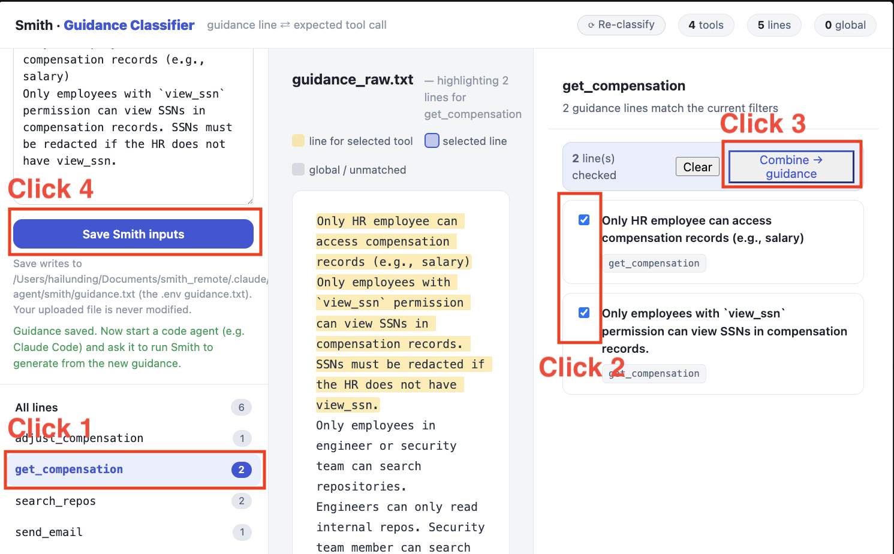

# HR Agent — Smith Example - How to start

## Prerequisites (run from the Smith skill directory):

```bash
bash scripts/clean.sh # optional: remove generated results and clear assets/policy.rego
cd examples/hr-agent
```

Make sure the `.env` in the Smith skill directory points to this example:
```dotenv
# --- the target agent (the HR agent's Smith shim) ---
AGENT_URL=http://localhost:9000

# --- point Smith at this example ---
TARGET_AGENT_PATH=examples/hr-agent/
GUIDANCE_FILE=examples/hr-agent/smith/guidance.txt
SYSTEM_VAR_FILE=examples/hr-agent/smith/system_vars.json
PROMPTFOO_CONFIG_FILE=examples/hr-agent/smith/promptfooconfig.yaml
PROMPTFOO_OUTPUT_FILE=examples/hr-agent/smith/redteam.yaml

# --- MCP transport ---
MCP_TRANSPORT=http
MCP_URL=http://localhost:9000/tool_definitions

# ---Inference model ---
INFERENCE_MODEL=aws/claude-haiku-4-5
INFERENCE_BASE_URL=${OPENAI_BASE_URL}
INFERENCE_API_KEY=${OPENAI_API_KEY}

```

Start the MCP server (separate terminal):

```bash
uvicorn server:app --host 0.0.0.0 --port 9100
```

Start the agent (separate terminal):

```bash
uvicorn agent:app --host 0.0.0.0 --port 9000
```


## How to Test Smith (End-to-End Workflow)


### Step 0: Select Tools and Guidance

From the Smith skill directory, start the Guidance Classifier:

```bash
smith --flag classify_guidance
```

Open the URL printed by the command (`http://127.0.0.1:8110/`) in a browser
or VS Code's Simple Browser. Then:

1. Upload `examples/employee/smith/guidance_raw.txt`.
2. Click 1: Select a tool, such as `get_compensation`.
3. Click 2: Check the guidance lines of this tool.
4. Click 3: Click **Combine → guidance** and review the combined text.
5. Click 4: Click **Save Smith inputs**.

Saving overwrites `examples/hr-agent/smith/guidance.txt` and records the selected
tools in `references/session_config.json`. The uploaded source file is unchanged.



### Step 1: Generate Policy and Test Cases

#### Step 1.1: Generate Policy

Ask your coding assistant to use the Smith skill to generate an OPA policy from the guidance file:

> Prompt: /smith generate an opa policy for the target agent

If Smith asks whether to limit the scope to the selected tools, confirm.

#### Step 1.2: Generate Test Cases

There are three ways to generate or reuse test cases:

1. After generating the policy, Smith asks whether to generate test cases or reuse existing ones. If generating cases, follow its suggestions to refresh the Promptfoo config, generate cases, and translate them. Test case evaluation is optional.

2. Generate test cases via CLI:

   ```bash
   smith --flag generate_promptfoo_config # optional: generate and review the Promptfoo config
   smith --flag test_generation --mode fresh # required: generate guidance-targeted cases
   smith --flag bypass_case_generation    # optional: policy-bypass cases (requires an existing, non-empty policy)
   smith --flag test_case_evaluation      # optional: visualize test cases without changing results
   smith --flag test_case_translation     # required: translate cases, skipping those already translated
   ```

3. To reuse the saved `get_compensation` cases, copy
   `examples/hr-agent/smith/smith_outputs/get_compensation/test_cases/` to
   `references/test_cases/`, then skip generation and translation.

### Step 2: Test the Policy

Run policy testing (ask Smith or via CLI):

- Smith: Follow Smith's suggestions and approve policy testing.

- CLI:

    ```bash
    smith --flag policy_testing
    ```

### Step 2.1: Cross-Validation

- **If there are 0 test cases or a 100% failure rate** — the policy may have structural or syntax issues. Ask Smith to cross-validate the policy (it will follow `opa_policy/policy_cross_validation/policy_cross_validation.md`).
- **If some tests pass and others fail** — some test case labels may be wrong. Ask Smith to cross-validate the test cases before running the refinement loop (it should follow `test_generation/cross_validate.md`). This step can take time, depending on the number of failed test cases.

### Step 3: Improve the Policy

### Step 3.1: Patch the Policy

If no test cases fail, Smith skips this step.

If test cases fail, follow Smith's suggestions to patch the policy:

**Fix failed test cases** — patch the policy to handle cases that should be denied but are currently allowed.

### Step 3.2: Lint the Policy

**Fix formatting issues** — resolve Regal lint warnings and `opa fmt` differences.

### Step 3.3: Remove Duplicate Rules

**Remove duplication** — eliminate redundant rules with overlapping logic.

## Expand the Tool Scope

- Go to the webpage opened in Step 0 and check all lines. 

- Click **Combine → guidance**

- click **Save Smith inputs**. 

Repeat Previous Step 1-3. But at this turn, you can choose update test cases rather than generate from scratch. 

```bash
smith --flag test_generation --mode update
```